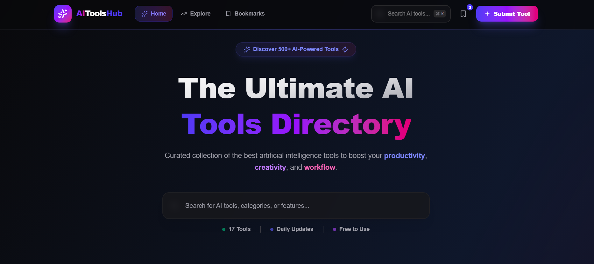
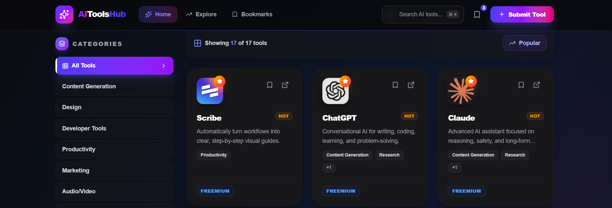
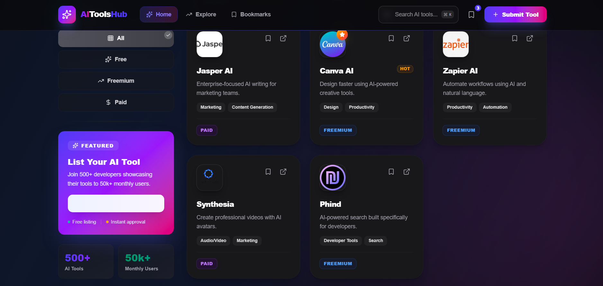
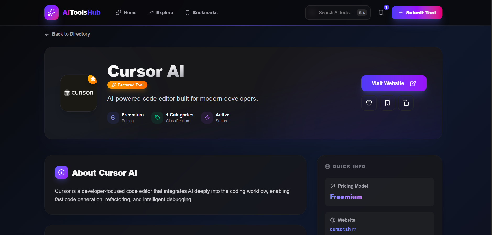
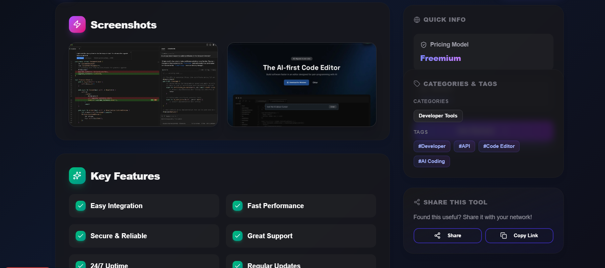
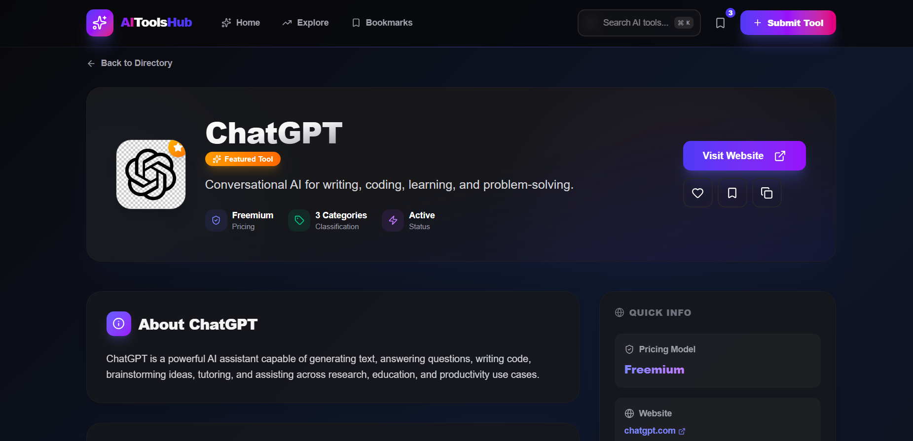

<div align="center">
  <h1>AI Forge: The Ultimate AI Tools Directory</h1>
  
  <p>
    An advanced, modern, and beautifully designed directory for discovering the best AI tools. Built with Next.js 15, React 19, Tailwind CSS v4, and Framer Motion.
  </p>

  <p>
    <a href="#features">Features</a> •
    <a href="#tech-stack">Tech Stack</a> •
    <a href="#screenshots">Screenshots</a> •
    <a href="#getting-started">Getting Started</a>
  </p>
</div>

<br />

## 🚀 Overview

AI Forge is a premium platform designed to help developers, creators, and businesses discover curated Artificial Intelligence tools. It features a responsive, glassmorphic UI with advanced filtering, search capabilities, and a seamless bookmarking system.

## ✨ Key Features

- **🔍 Advanced Exploration**: Powerful search and multi-dimensional filtering (Categories, Pricing, Tags).
- **🎨 Modern UI/UX**: Stunning glassmorphism design with smooth Framer Motion animations.
- **📱 Fully Responsive**: Optimized for all devices, from desktops to mobile phones.
- **🔖 Bookmarking System**: Local storage-based bookmarking to save your favorite tools for later.
- **📝 Submission Portal**: A dedicated page for users to submit new AI tools to the directory.
- **⚡ High Performance**: Built on Next.js 15 (Turbo) for blazing fast load times and SEO optimization.
- **🌙 Dark Mode Ready**: Designed with a sophisticated color palette that looks great in all lighting conditions.

## 🛠️ Tech Stack

- **Framework**: [Next.js 15](https://nextjs.org/) (App Router)
- **Language**: [TypeScript](https://www.typescriptlang.org/)
- **Styling**: [Tailwind CSS v4](https://tailwindcss.com/)
- **Animations**: [Framer Motion](https://www.framer.com/motion/)
- **Icons**: [Lucide React](https://lucide.dev/)
- **State Management**: React Hooks (`useState`, `useReducer`, custom `useLocalStorage`)
- **Fonts**: Geist Sans & Geist Mono

## 📸 Screenshots

<div align="center" id="screenshots">
  
  <p><em>Home Page - A visual grid of top AI tools</em></p>
  <br />
  
  
  <p><em>Explore Page - Advanced filtering and search</em></p>
  <br />

  <div style="display: flex; gap: 20px; justify-content: center; flex-wrap: wrap;">
    
    
  </div>
  <p><em>Tool Details & Bookmarks Manager</em></p>
  <br/>

   <div style="display: flex; gap: 20px; justify-content: center; flex-wrap: wrap;">
    
    
  </div>
   <p><em>Submission Portal & Responsive Mobile View</em></p>

</div>

## 🚀 Getting Started

First, clone the repository:

```bash
git clone https://github.com/yogeshthapa-7/ai-tools-directory.git
cd ai-tools-directory/ai-tools
```

Install dependencies:

```bash
npm install
# or
yarn install
# or
pnpm install
```

Run the development server:

```bash
npm run dev
# or
yarn dev
# or
pnpm dev
```

Open [http://localhost:3000](http://localhost:3000) with your browser to see the result.

## 🤝 Contribution

Contributions are welcome! Please feel free to submit a Pull Request.

1. Fork the Project
2. Create your Feature Branch (`git checkout -b feature/AmazingFeature`)
3. Commit your Changes (`git commit -m 'Add some AmazingFeature'`)
4. Push to the Branch (`git push origin feature/AmazingFeature`)
5. Open a Pull Request

<div align="center">
  <p>Star ⭐ this repository if you find it useful!</p>
  <p>Developed with ❤️ by <a href="https://github.com/yogeshthapa-7">Yogesh Thapa</a></p>
</div>
